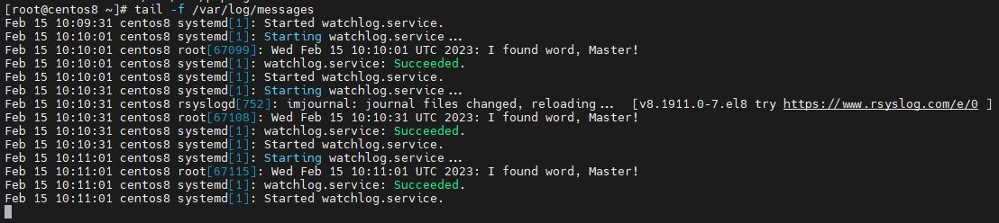
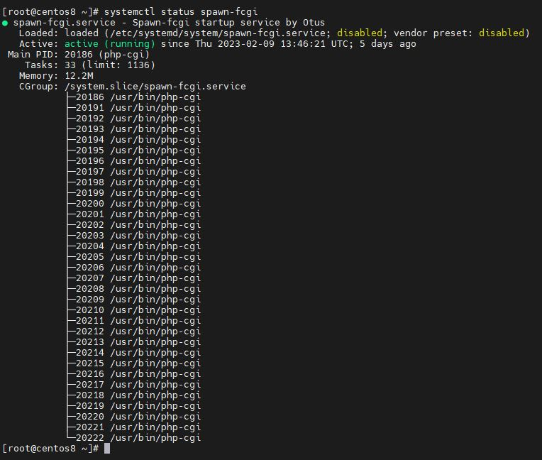
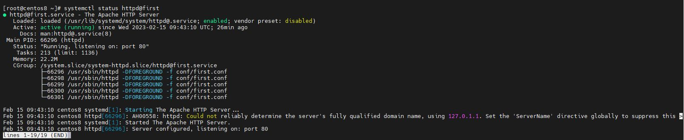
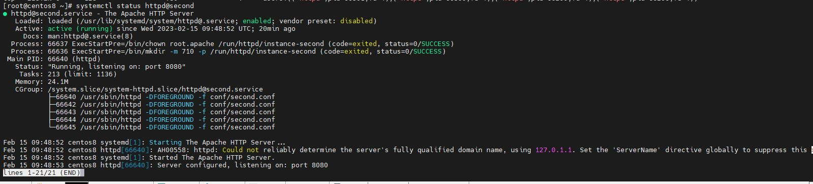
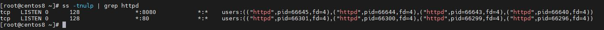

# Домашнее задание "Systemd"

## Написать сервис, который будет раз в 30 секунд мониторить лог на предмет наличиы ключевого слова. Файл и слово должны задаваться в /etc/sysconfig

1. /watchlog/watchlog - создаём файл с конфигурацией для сервиса в директории;
2. /watchlog/watchlog.sh - создадим скрипт на поиск ключевого слова в логе;
3. /watchlog/watchlog.service - создадим юнит для сервиса:
4. /watchlog/watchlog.timer -создадим юнит для таймера:

Стартуем юнит timer:

```
systemctl start watchlog.timer
```

#### Проверка:

Проверить log на наличие сообщений "Started My watchlog service."
```
tail -f /var/log/messages
```



## Из epel установить spawn-fcgi и переписать init-скрипт на unit-файл. Имя сервиса должно также называться.
```
yum install epel-release -y && yum install spawn-fcgi php php-climod_fcgid httpd -y
```
1. /spawn-fcgi/spawn-fcgi - файл параметров
2. /spawn-fcgi/spawn-fcgi.service - файл описания юнита

#### Проверка

```
systemctl start spawn-fcgi
systemctl status spawn-fcgi
```



## Дополнить юнит-файл apache httpd возможностью запустить несколько инстансов сервера с разными конфигами

```
yum install httpd -y
```

#### Файлы

1. /httpd/https.service - шаблон конфигурации файла окружения
2. /httpd/first.conf - первая конфигурация apache в /etc/httpd/conf/
4. /httpd/second.conf - вторая конфигурация apache в /etc/httpd/conf/
5. /httpd/httpd-first - файл окружения для первого сервиса определяющего путь к файлу настроек в /etc/sysconfig/
6. /httpd/httpd-second - файл окружения для второго сервиса определяющего путь к файлу настроек в /etc/sysconfig/

```
systemctl enable httpd@first
systemctl enable httpd@second
systemctl start httpd@first
systemctl start httpd@second
```

#### Проверка

Проверка первого сервиса
```
systemctl status httpd@first
```



Проверка второго сервиса
```
systemctl status httpd@second
```



Проверка портов:
```
ss -tnulp | grep httpd
```


